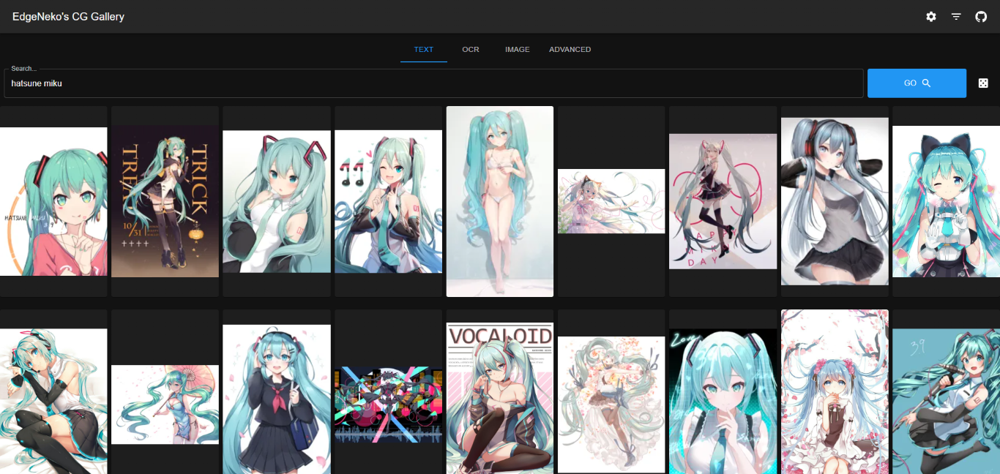
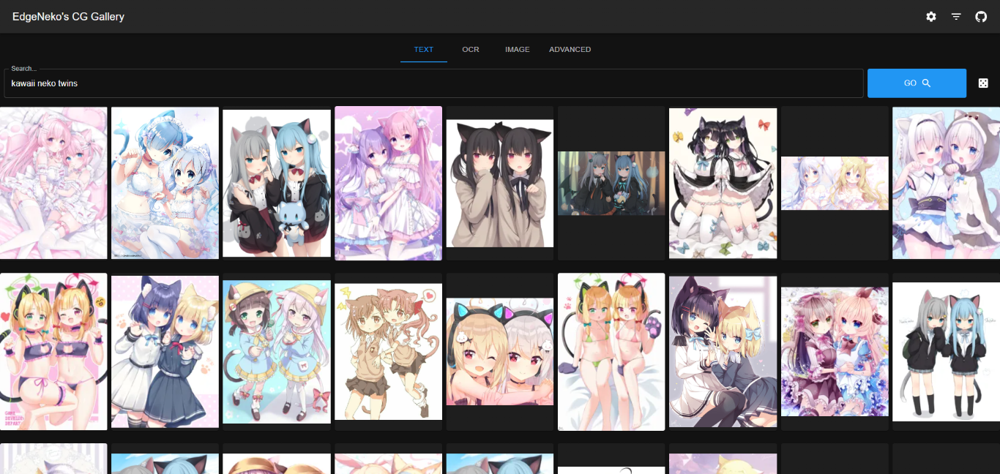
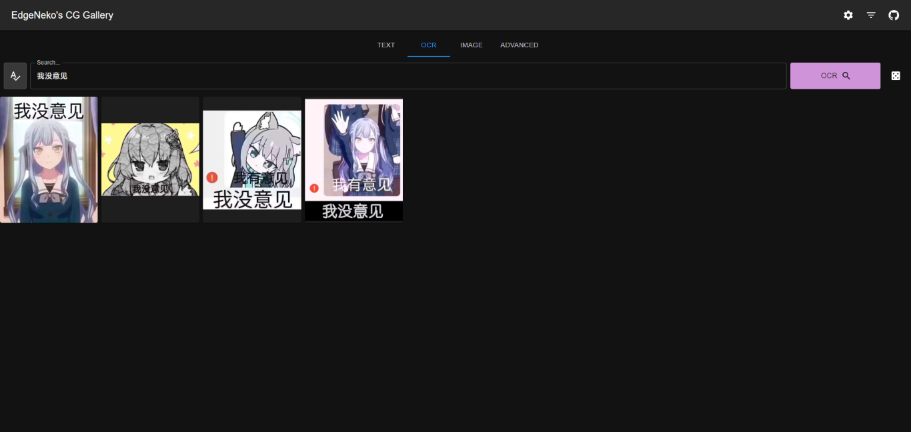
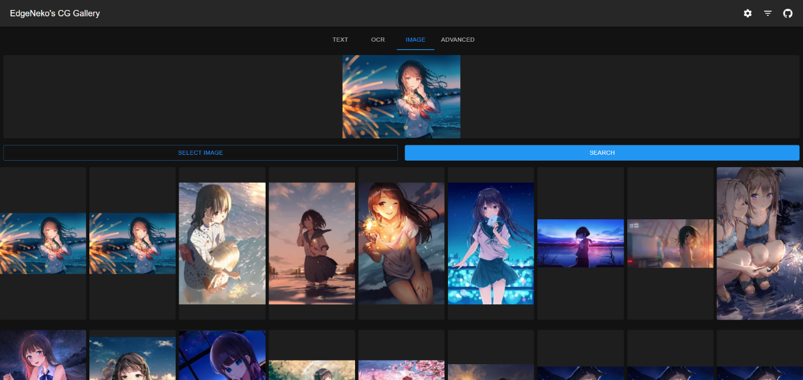
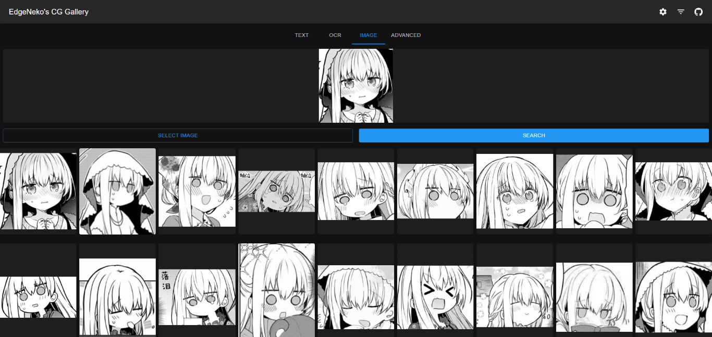
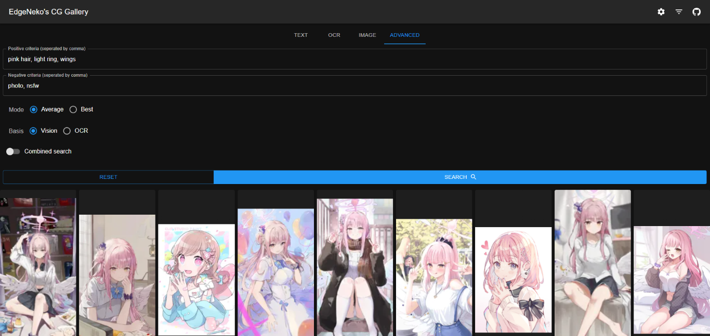

# NekoImageGallery

[](https://github.com/hv0905/NekoImageGallery/actions)
[](https://codecov.io/gh/hv0905/NekoImageGallery)

[](https://hub.docker.com/r/edgeneko/neko-image-gallery)
[](https://deepwiki.com/hv0905/NekoImageGallery)

An online AI image search engine based on the Clip model and Qdrant vector database. Supports keyword search and similar
image search.

[中文文档](readme_cn.md)

## ✨ Features

- Use the Clip model to generate 768-dimensional vectors for each image as the basis for search. No need for manual
  annotation or classification, unlimited classification categories.
- OCR Text search is supported, use PaddleOCR to extract text from images and use BERT to generate text vectors for
  search.
- Use Qdrant vector database for efficient vector search.

## 📷Screenshots








> The above screenshots may contain copyrighted images from different artists, please do not use them for other
> purposes.

## ✈️ Deployment

### 📦 Prerequisites

#### Hardware requirements

| Hardware | Minimum                                       | Recommended                                              |
|----------|-----------------------------------------------|----------------------------------------------------------|
| CPU      | X86_64 or ARM64 CPU, 2 cores or more          | 4 cores or more                                          |
| RAM      | 4GB or more                                   | 8GB or more                                              |
| Storage  | 10GB or more for libraries, models, and datas | 50GB or more, SSD is recommended                         |
| GPU      | Not required                                  | CUDA supported GPU for acceleration, 4GB of VRAM or more |

#### Software requirements

- For local deployment: Python 3.10 ~ Python 3.12,
  with [uv package manager](https://docs.astral.sh/uv/getting-started/installation/) installed.
- For Docker deployment: Docker and Docker Compose (For CUDA users, `nvidia-container-runtime` is required) or
  equivalent
  container runtime.

### 🖥️ Local Deployment

#### Choose a metadata storage method

##### Qdrant Database (Recommended)

In most cases, we recommend using the Qdrant database to store metadata. The Qdrant database provides efficient
retrieval performance, flexible scalability, and better data security.

Please deploy the Qdrant database according to
the [Qdrant documentation](https://qdrant.tech/documentation/quick-start/). It is recommended to use Docker for
deployment.

If you don't want to deploy Qdrant yourself, you can use
the [online service provided by Qdrant](https://qdrant.tech/documentation/cloud/).

##### Local File Storage

Local file storage directly stores image metadata (including feature vectors, etc.) in a local SQLite database. It is
only recommended for small-scale deployments or development deployments.

Local file storage does not require an additional database deployment process, but has the following disadvantages:

- Local storage does not index and optimize vectors, so the time complexity of all searches is `O(n)`. Therefore, if the
  data scale is large, the performance of search and indexing will decrease.
- Using local file storage will make NekoImageGallery stateful, so it will lose horizontal scalability.
- When you want to migrate to Qdrant database for storage, the indexed metadata may be difficult to migrate directly.

#### Deploy NekoImageGallery

> [!NOTE]
> This tutorial is for NekoImageGallery v1.4.0 and later, in which we switch to `uv` as package manager. If you are
> using an earlier version, please refer to the README file in the corresponding version tag.

1. Clone the project directory to your own PC or server, then checkout to a specific version tag (like `v1.4.0`).
2. Install the required dependencies:
    ```shell
    uv sync --no-dev --extra cpu # For CPU-only deployment
   
    uv sync --no-dev --extra cu124 # For CUDA v12.4 deployment
   
    uv sync --no-dev --extra cu118 # For CUDA v11.8 deployment
    ```

> [!NOTE]
> - It's required to specify the `--extra` option to install the correct dependencies. If you don't specify the
    `--extra` option, PyTorch and its related dependencies will not be installed.
> - If you want to use CUDA for accelerated inference, be sure to select the CUDA-enabled extra variant in this step
    (we recommend `cu124` unless your platform does not support cuda12+). After installation, you can use
    `torch.cuda.is_available()` to confirm that CUDA is available.
> - If you are developing or testing, you can sync without the `--no-dev` switch to install the dependencies required
    for development, testing, and code checking.

3. Modify the configuration file in the `config` directory as needed. You can directly modify `default.env`, but it is
   recommended to create a file named `local.env` to override the configuration in `default.env`.
4. (Optional) Enable the built-in frontend:
   NekoImageGallery v1.5.0+ has a built-in frontend application based
   on [NekoImageGallery.App](https://github.com/hv0905/NekoImageGallery.App).
   To enable it, set `APP_WITH_FRONTEND=True` in your configuration file.
   > [!WARNING]
   > After enabling the built-in frontend, all APIs will be automatically mounted under the `/api` sub-path. For
   example, the original `/docs` will become `/api/docs`.
   > This may affect your existing deployment, please proceed with caution.
5. Run the application:
    ```shell
    uv run main.py
    ```
   You can specify the ip address to bind to with `--host` (default is 0.0.0.0) and the port to bind to with `--port`
   (default is 8000).
   You can view all available commands and options with `uv run main.py --help`.
6. (Optional) Deploy the frontend application: If you do not want to use the built-in frontend, or want to deploy the
   frontend independently, you can refer to
   the [deployment documentation](https://github.com/hv0905/NekoImageGallery.App) of
   [NekoImageGallery.App](https://github.com/hv0905/NekoImageGallery.App).

### 🐋 Docker Deployment

#### About Docker Images

NekoImageGallery's docker image are built and released on Docker Hub, including serval variants:

| Tags                                                                                                                                        | Description                                                | Latest Image Size                                                                                                                                                                                 |
|---------------------------------------------------------------------------------------------------------------------------------------------|------------------------------------------------------------|---------------------------------------------------------------------------------------------------------------------------------------------------------------------------------------------------|
| `edgeneko/neko-image-gallery:<version>`<br>`edgeneko/neko-image-gallery:<version>-cuda`<br>`edgeneko/neko-image-gallery:<version>-cuda12.4` | Supports GPU inferencing with CUDA12.4                     | [)](https://hub.docker.com/r/edgeneko/neko-image-gallery)              |
| `edgeneko/neko-image-gallery:<version>-cuda11.8`                                                                                            | Supports GPU inferencing with CUDA11.8                     | [)](https://hub.docker.com/r/edgeneko/neko-image-gallery) |
| `edgeneko/neko-image-gallery:<version>-cpu`                                                                                                 | Supports CPU inferencing                                   | [)](https://hub.docker.com/r/edgeneko/neko-image-gallery)           |
| `edgeneko/neko-image-gallery:<version>-cpu-arm`                                                                                             | (Alpha) Supports CPU inferencing on ARM64(aarch64) devices | [)](https://hub.docker.com/r/edgeneko/neko-image-gallery)   |

Where `<version>` is the version number or version alias of NekoImageGallery, as follows:

| Version           | Description                                                                                            |
|-------------------|--------------------------------------------------------------------------------------------------------|
| `latest`          | The latest stable version of NekoImageGallery                                                          |
| `v*.*.*` / `v*.*` | The specific version number (correspond to Git tags)                                                   |
| `edge`            | The latest development version of NekoImageGallery, may contain unstable features and breaking changes |

In each image, we have bundled the necessary dependencies, `openai/clip-vit-large-patch14` model
weights, `bert-base-chinese` model weights and `easy-paddle-ocr` models to provide a complete and ready-to-use image.

The images uses `/opt/NekoImageGallery/static` as volume to store image files, mount it to your own volume or directory
if local storage is required.

For configuration, we recommend using environment variables to override the default configuration. Secret information
(such as API tokens) can be provided through [docker secrets](https://docs.docker.com/engine/swarm/secrets/).

> [!NOTE]
> To enable the built-in frontend, please set the environment variable `APP_WITH_FRONTEND=True`.
> After enabling, all APIs will be automatically mounted under the `/api` sub-path, please ensure that your reverse
> proxy and other configurations are correct.

#### Prepare `nvidia-container-runtime`

If you want to support CUDA acceleration during inference, please refer to
the [Docker GPU related documentation](https://docs.docker.com/config/containers/resource_constraints/#gpu)
for installation.

> Related Document:
> 1. https://docs.docker.com/config/containers/resource_constraints/#gpu
> 2. https://docs.nvidia.com/datacenter/cloud-native/container-toolkit/install-guide.html#docker
> 3. https://nvidia.github.io/nvidia-container-runtime/

#### Run the server

1. Download the `docker-compose.yml` file from repository.
   ```shell
   # For cuda deployment (default)
   wget https://raw.githubusercontent.com/hv0905/NekoImageGallery/master/docker-compose.yml
   # For CPU-only deployment
   wget https://raw.githubusercontent.com/hv0905/NekoImageGallery/master/docker-compose-cpu.yml && mv docker-compose-cpu.yml docker-compose.yml
   ```
2. Modify the docker-compose.yml file as needed
3. Run the following command to start the server:
    ```shell
    # start in foreground
    docker compose up
    # start in background(detached mode)
    docker compose up -d
    ```

### Upload images to NekoImageGallery

There are several ways to upload images to NekoImageGallery:

- Via web interface: You can use the built-in web interface or the
  standalone [NekoImageGallery.App](https://github.com/hv0905/NekoImageGallery.App) to upload images to the server.
  Please make sure you have enabled the **Admin API** and set your **Admin Token** in the configuration file.
- Via local indexing: This is suitable for local deployment or when the images you want to upload are already on the
  server.
  Use the following command to index your local image directory:
  ```shell
   python main.py local-index <path-to-your-image-directory>
  ```
  The above command will recursively upload all images in the specified directory and its subdirectories to the server.
  You can also specify categories/starred for images you upload, see `python main.py local-index --help` for more
  information.
- Via API: You can use the upload API provided by NekoImageGallery to upload images. By using this method, the
  server can prevent saving the image files locally but only store their URLs and metadata.  
  Please make sure you have enabled the **Admin API** and set your **Admin Token** in the configuration file.
  This method is suitable for automated image uploading or synchronizing NekoImageGallery with external systems. For
  more information, please check the [API documentation](#-api-documentation).

## 📚 API Documentation

The API documentation is provided by the built-in Swagger UI of FastAPI. You can view the API documentation by
accessing the `/docs` or `/redoc` path of the server.

> [!NOTE]
> If you enable the built-in frontend, the path to the API documentation will become `/api/docs` and `/api/redoc`.

## 🐸 Other Information

For a more detailed Wiki of the project, including how the project works, you can visit the Wiki generated by DeepWiki:
[NekoImageGallery DeepWiki](https://deepwiki.com/hv0905/NekoImageGallery).

(The wiki is generated automatically and is not fully reviewed by the project team, so read with caution.)

## ⚡ Related Project

Those project works with NekoImageGallery :D

[](https://github.com/hv0905/NekoImageGallery.App)
[](https://github.com/pk5ls20/LiteLoaderQQNT-NekoImageGallerySearch)
[](https://github.com/pk5ls20/pk5ls20/nonebot-plugin-nekoimage)

## 📊 Repository Summary


## ♥ Contributing

There are many ways to contribute to the project: logging bugs, submitting pull requests, reporting issues, and creating
suggestions.

Even if you with push access on the repository, you should create a personal feature branches when you need them.
This keeps the main repository clean and your workflow cruft out of sight.

We're also interested in your feedback on the future of this project. You can submit a suggestion or feature request
through the issue tracker. To make this process more effective, we're asking that these include more information to help
define them more clearly.

## Copyright

Copyright 2025 EdgeNeko

Licensed under AGPLv3 license.
